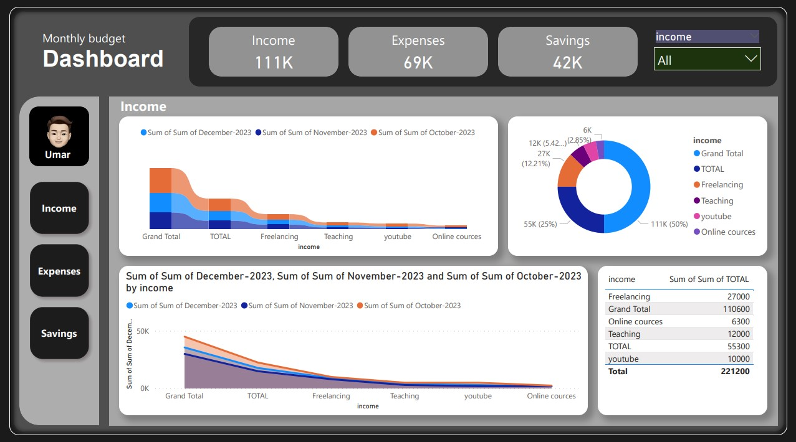

# Monthly Budget Interactive Dashboard

## Project Description

"I've created a Monthly Budget Interactive Dashboard using Power BI. This dashboard is designed to help you effectively track, analyze, and manage your monthly budget with ease. It offers a comprehensive overview of your financial data, empowering you to make informed financial decisions and plan effectively."

## Key Features

- **Budget Overview:** "Get a quick snapshot of your monthly budget, including income, expenses, and savings goals, with color-coded visualizations for easy tracking."

- **Monthly Breakdown:** "Dive deeper into your budget by exploring month-by-month breakdowns to compare actual spending against budgeted amounts over time."

- **Expense Categories:** "Gain detailed insights into your spending categories and identify areas for optimization using interactive filters."

- **Income Tracking:** "Input your income sources and view total earnings for the month to understand their impact on your finances."

- **Savings Goals:** "Set and monitor savings goals with visual progress indicators, helping you stay on track."

- **Interactive Filters:** "Customize the dashboard with flexible filtering options to focus on specific financial elements."

- **Visual Data Representation:** "Visual charts, graphs, and tables make it easy to grasp complex financial information quickly."

- **User-Friendly Interface:** "Designed for users of all levels, the intuitive interface includes tooltips and interactive elements to provide additional context and insights."

- **Export and Share:** "Export reports or share the dashboard with others to facilitate collaboration on financial planning and analysis."

- **Data Security:** "Your financial data is kept secure and private with authentication and access controls as needed."

## Getting Started

"To use the Monthly Budget Interactive Dashboard, simply follow the installation instructions below."

## Installation

1. "Clone this repository to your local machine."
2. "Open the Power BI file included in the repository."
3. "Customize the dashboard with your own financial data and preferences."
4. "Explore your monthly budget and make informed financial decisions."

## Usage

"For detailed instructions on how to use the dashboard effectively, refer to the user guide provided in the repository."

## Contributions

"We welcome contributions to improve and enhance this project. Please follow the guidelines in the CONTRIBUTING.md file."

